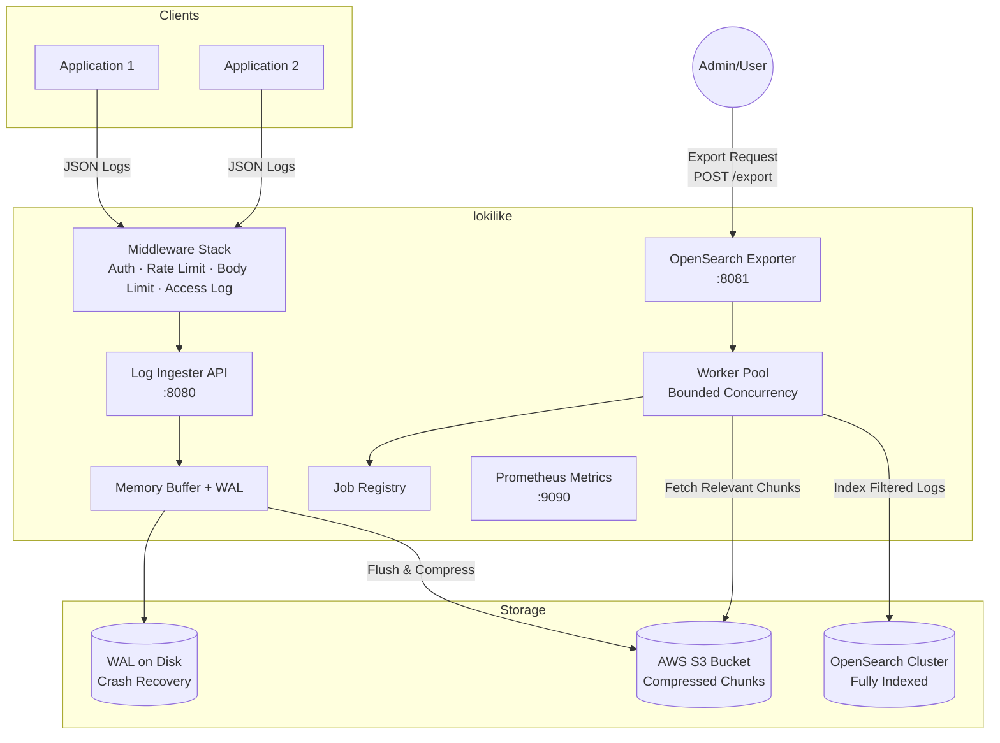
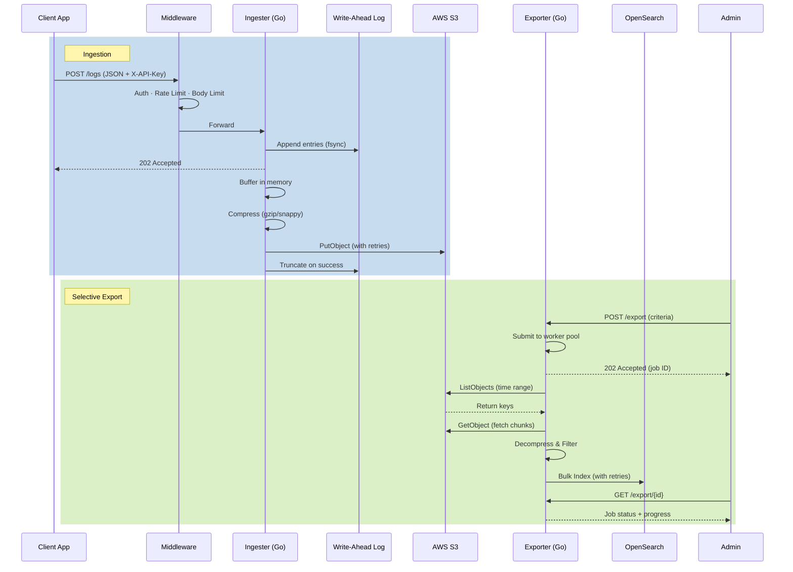

# lokilike

A lightweight, horizontally scalable log aggregation system that uses S3 as its primary backing store. Designed from first principles around the idea that most logs should live in cheap object storage, and only a targeted subset should be fully indexed for deep analysis.

## Architecture



### Data Flow



## Design Philosophy

**Store everything, index selectively.** Traditional log systems index every line on ingest, which gets expensive fast. lokilike takes a different approach:

1. **Ingest cheaply** — logs are buffered in memory (with a WAL for crash safety), compressed, and flushed to S3. S3 is the source of truth.
2. **Export on demand** — an export job scans relevant S3 chunks (scoped by time, service, labels), decompresses them, filters, and pushes only matching logs to OpenSearch.

This means you pay S3 prices for retention and OpenSearch prices only for what you're investigating.

## Project Structure

```
lokilike/
├── cmd/
│   ├── ingester/main.go           # Ingestion server
│   └── exporter/main.go           # Export worker + job API
├── internal/
│   ├── config/config.go           # Config with validation + defaults
│   ├── domain/
│   │   ├── log_entry.go           # LogEntry struct
│   │   ├── chunk.go               # Chunk + compression types
│   │   └── export_job.go          # ExportJob lifecycle
│   ├── ingester/
│   │   ├── buffer.go              # Buffer with WAL, level sampling, flush-failure retention
│   │   ├── handler.go             # POST /logs with entry limits
│   │   ├── s3_flusher.go          # S3 writer with retries
│   │   └── wal.go                 # Write-ahead log for crash recovery
│   ├── exporter/
│   │   ├── exporter.go            # S3 scan, decompress, filter, export with retries
│   │   ├── opensearch.go          # OpenSearch bulk index client
│   │   ├── registry.go            # In-memory job registry with cancellation
│   │   └── pool.go                # Bounded worker pool
│   ├── logger/logger.go           # Structured JSON logging via slog
│   ├── metrics/metrics.go         # Prometheus metrics definitions
│   ├── middleware/middleware.go    # Auth, rate limit, body limit, access log
│   ├── retry/retry.go             # Exponential backoff with jitter
│   ├── storage/s3.go              # S3 client with metrics
│   └── integration/
│       └── integration_test.go    # Integration tests (MinIO)
├── config.json                    # Production config template
├── config.local.json              # Local dev config (MinIO + OpenSearch)
├── docker-compose.yml             # MinIO + OpenSearch for local dev
└── Makefile
```

## Quick Start

### Prerequisites

- Go 1.21+
- Docker & Docker Compose

### Local Development

```bash
make dev-up          # Start MinIO + OpenSearch
make run-ingester    # Start ingester on :8080
make run-exporter    # Start exporter on :8081 (separate terminal)
```

MinIO console: `http://localhost:9001` (minioadmin/minioadmin)

### Send Logs

```bash
curl -X POST http://localhost:8080/logs \
  -H "Content-Type: application/json" \
  -d '{
    "entries": [
      {
        "timestamp": "2026-03-23T10:00:00Z",
        "service": "myapp",
        "level": "info",
        "message": "user logged in",
        "labels": {"env": "prod", "region": "us-west-2"}
      },
      {
        "timestamp": "2026-03-23T10:01:00Z",
        "service": "myapp",
        "level": "error",
        "message": "database connection timeout",
        "labels": {"env": "prod"}
      }
    ]
  }'
```

### Trigger an Export

```bash
# Start an export job
curl -X POST http://localhost:8081/export \
  -H "Content-Type: application/json" \
  -d '{
    "start_time": "2026-03-23T00:00:00Z",
    "end_time": "2026-03-24T00:00:00Z",
    "service": "myapp",
    "label_filters": {"env": "prod"}
  }'
# Returns: {"id": "<job-id>", "status": "pending", ...}

# Poll job status
curl http://localhost:8081/export/<job-id>

# List all jobs
curl http://localhost:8081/export

# Cancel a running job
curl -X DELETE http://localhost:8081/export/<job-id>
```

## Configuration

Configuration is JSON with `${ENV_VAR}` expansion.

```json
{
  "debug": false,
  "tenant_id": "",
  "ingester": {
    "listen_address": ":8080",
    "batch_size_bytes": 5242880,
    "batch_time_window_sec": 30,
    "compression_algo": "gzip",
    "max_body_bytes": 10485760,
    "max_entries_per_request": 10000,
    "rate_limit_rps": 0,
    "wal_dir": "/var/lib/lokilike/wal",
    "tls": { "enabled": false, "cert_file": "", "key_file": "" },
    "min_level": ""
  },
  "storage": {
    "s3": {
      "bucket": "my-log-bucket",
      "region": "us-west-2",
      "prefix": "raw_logs/",
      "endpoint": "",
      "use_path_style": false,
      "retention_days": 90
    }
  },
  "exporter": {
    "listen_address": ":8081",
    "opensearch": {
      "endpoint": "https://my-cluster.example.com",
      "index_prefix": "exported-logs-",
      "username": "${OS_USERNAME}",
      "password": "${OS_PASSWORD}"
    },
    "default_batch_size": 1000,
    "max_concurrent_jobs": 4
  },
  "auth": { "enabled": true, "api_keys": ["${API_KEY}"] },
  "metrics": { "enabled": true, "address": ":9090" }
}
```

### Settings Reference

| Setting | Description | Default |
|---------|-------------|---------|
| `debug` | Enable DEBUG-level structured logging | `false` |
| `tenant_id` | Tenant prefix for S3 paths and OpenSearch indices | `""` |
| `ingester.batch_size_bytes` | Flush when buffer exceeds this size | 5 MB |
| `ingester.batch_time_window_sec` | Flush after this many seconds | 30 |
| `ingester.compression_algo` | `gzip` or `snappy` | `gzip` |
| `ingester.max_body_bytes` | Max HTTP request body size | 10 MB |
| `ingester.max_entries_per_request` | Max entries per POST /logs | 10000 |
| `ingester.rate_limit_rps` | Requests per second (0 = unlimited) | 0 |
| `ingester.wal_dir` | WAL directory for crash recovery (empty = disabled) | `""` |
| `ingester.tls.enabled` | Enable TLS on the ingester | `false` |
| `ingester.min_level` | Drop log entries below this level (e.g., `warn`) | `""` |
| `storage.s3.endpoint` | Custom S3 endpoint (MinIO/LocalStack) | `""` |
| `storage.s3.retention_days` | Document S3 lifecycle policy TTL | 90 |
| `exporter.max_concurrent_jobs` | Max parallel export jobs | 4 |
| `auth.enabled` | Require X-API-Key header | `false` |
| `auth.api_keys` | Valid API keys | `[]` |
| `metrics.enabled` | Expose Prometheus /metrics | `false` |
| `metrics.address` | Metrics server listen address | `:9090` |

Config is validated on startup — missing required fields or invalid values will prevent the service from starting.

## Production Features

### Write-Ahead Log (WAL)

Set `ingester.wal_dir` to enable crash recovery. Entries are appended to an NDJSON WAL file (with fsync) before being buffered in memory. After a successful S3 flush, the WAL is truncated. On startup, uncommitted entries are replayed into the buffer.

### Retry with Exponential Backoff

All S3 writes and OpenSearch bulk-index operations retry up to 3 times with exponential backoff and jitter (200ms base, 10s max). Transient failures don't cause data loss.

### Flush Failure Retention

If an S3 flush fails, the buffer is **not cleared**. Entries remain in memory (and WAL) for retry on the next flush cycle. Previously, failures silently dropped batches.

### Request Body & Entry Limits

- `max_body_bytes` (default 10MB): Limits HTTP request body via `MaxBytesReader` to prevent OOM from oversized payloads.
- `max_entries_per_request` (default 10,000): Rejects requests with too many entries (413).

### API Key Authentication

Set `auth.enabled: true` and provide API keys. All requests (except `/health` and `/metrics`) require a valid `X-API-Key` header. Keys are configured via the JSON config with env var expansion for secrets.

### Rate Limiting

Set `ingester.rate_limit_rps` to enable a token-bucket rate limiter. Excess requests receive `429 Too Many Requests`.

### TLS

Set `ingester.tls.enabled: true` with `cert_file` and `key_file` to serve HTTPS. Config validation ensures both files are specified when TLS is enabled.

### Bounded Export Concurrency

Export jobs are submitted to a worker pool with `max_concurrent_jobs` slots (default 4). If the pool is full, `POST /export` returns `503 Service Unavailable`. Each job gets its own cancellable context.

### Export Job Management

```
POST   /export         Create an export job (202 Accepted)
GET    /export          List all jobs
GET    /export/{id}    Poll job status and progress
DELETE /export/{id}    Cancel a running job
```

Jobs track: `chunks_total`, `chunks_processed`, `logs_exported`, `error_count`, and status lifecycle (`pending` → `running` → `completed`/`failed`).

### Compression Negotiation

Set `compression_algo` to `gzip` (default) or `snappy`. Snappy is faster for high-throughput workloads; gzip compresses better. The exporter auto-detects compression from the chunk file extension (`.gz` or `.sz`).

### Log Level Sampling

Set `ingester.min_level` (e.g., `warn`) to drop entries below that level during ingestion. Useful for reducing storage costs under high load while keeping error-level visibility.

### Multitenancy

Set `tenant_id` to scope all S3 paths under `<prefix>/<tenant_id>/` and isolate data per tenant. Deploy one instance per tenant with different configs.

### Structured Logging

All internal logging uses Go's `log/slog` with JSON output to stderr. Every log line includes structured fields (`key`, `entries`, `job_id`, `duration_ms`, etc.) for machine parsing.

### Access Logging

Every HTTP request is logged with method, path, status code, duration, and bytes written. Metrics are also recorded per-request.

## Prometheus Metrics

Enable with `metrics.enabled: true`. Metrics are served at `http://<metrics.address>/metrics`.

| Metric | Type | Description |
|--------|------|-------------|
| `lokilike_entries_received_total` | Counter | Log entries accepted |
| `lokilike_entries_dropped_total` | Counter | Entries dropped (by reason) |
| `lokilike_entries_buffered` | Gauge | Current buffer depth |
| `lokilike_chunks_flushed_total` | Counter | Chunks written to S3 |
| `lokilike_flush_errors_total` | Counter | Failed flush attempts |
| `lokilike_flush_duration_seconds` | Histogram | Compress + upload latency |
| `lokilike_bytes_flushed_total` | Counter | Compressed bytes to S3 |
| `lokilike_wal_entries` | Gauge | Current WAL depth |
| `lokilike_wal_recovered_total` | Counter | Entries recovered on startup |
| `lokilike_s3_operations_total` | Counter | S3 calls by operation/status |
| `lokilike_s3_duration_seconds` | Histogram | S3 operation latency |
| `lokilike_export_jobs_total` | Counter | Export jobs by final status |
| `lokilike_export_logs_indexed_total` | Counter | Logs sent to OpenSearch |
| `lokilike_bulk_index_duration_seconds` | Histogram | OpenSearch bulk latency |
| `lokilike_http_requests_total` | Counter | HTTP requests by method/path/status |
| `lokilike_http_duration_seconds` | Histogram | HTTP request latency |

## S3 Key Layout

```
raw_logs/
  [tenant_id/]
    myapp/
      2026/
        03/
          23/
            1679558400-a1b2c3d4.gz   (gzip)
            1679558430-e5f6a7b8.sz   (snappy)
```

### S3 Retention

Set `storage.s3.retention_days` as documentation for your bucket lifecycle policy. **You must configure the actual S3 lifecycle rule on the bucket itself** (e.g., via Terraform or the AWS console) to auto-delete objects after N days.

## Testing

### Unit Tests

```bash
make test    # 31 tests across ingester, exporter, retry
```

Covers: compression round-trips (gzip + snappy), size/time flush triggers, flush-failure retention, min-level sampling, HTTP handler validation, entry limits, export filtering, time prefix generation, retry logic with context cancellation.

### Integration Tests

```bash
make test-integration    # Requires Docker (starts MinIO automatically)
```

Tests S3 round-trip (put/get/list) and full ingest pipeline against MinIO.

## Makefile

| Target | Description |
|--------|-------------|
| `make build` | Compile all packages |
| `make test` | Run unit tests |
| `make test-integration` | Start Docker, run integration tests |
| `make dev-up` / `make dev-down` | Manage local Docker services |
| `make run-ingester` | Run ingester with local config |
| `make run-exporter` | Run exporter with local config |

## Deployment Notes

- AWS SDK credential resolution: env vars, IAM roles, instance profiles
- Leave `storage.s3.endpoint` empty for real AWS S3
- Set `auth.enabled: true` and inject API keys via `${ENV_VARS}`
- Both services expose `/health` for load balancer health checks
- WAL directory should be on fast local storage (not NFS)
- Graceful shutdown: SIGINT/SIGTERM flushes buffer, drains export jobs
- Set up an S3 lifecycle rule matching `retention_days` for automatic cleanup
