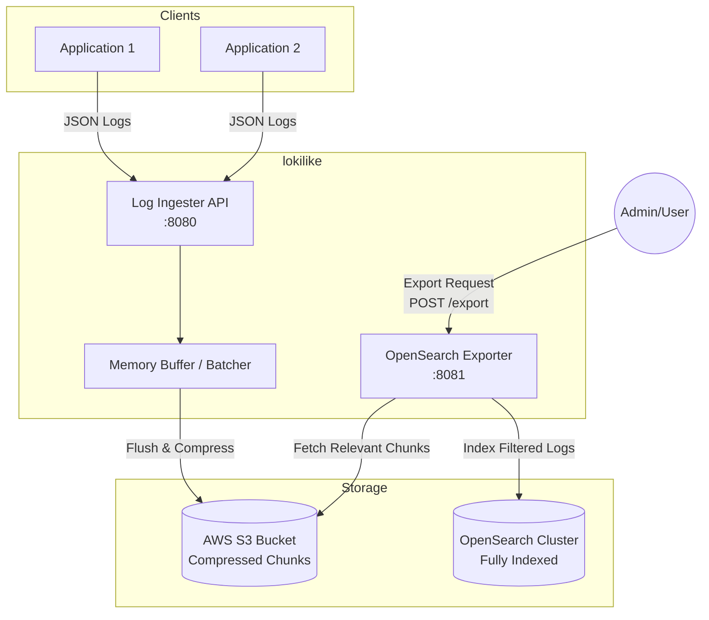
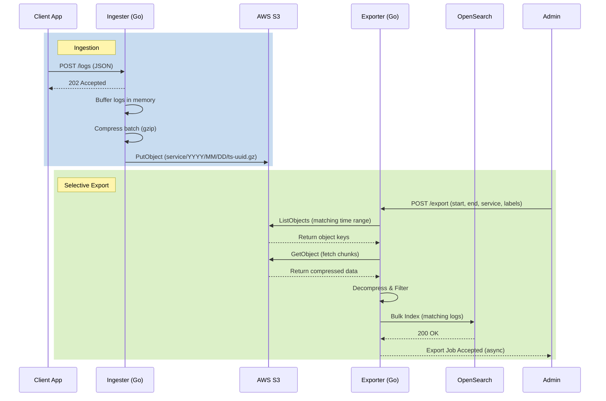

# lokilike

A lightweight, horizontally scalable log aggregation system that uses S3 as its primary backing store. Designed from first principles around the idea that most logs should live in cheap object storage, and only a targeted subset should be fully indexed for deep analysis.

## Architecture



### Data Flow



## Design Philosophy

**Store everything, index selectively.** Traditional log systems index every line on ingest, which gets expensive fast. lokilike takes a different approach:

1. **Ingest cheaply** — logs are buffered in memory, compressed with gzip, and flushed to S3 as newline-delimited JSON chunks. S3 is the source of truth.
2. **Export on demand** — when you need to search, an export job scans the relevant S3 chunks (scoped by time range, service, and labels), decompresses them, filters, and pushes only matching logs to OpenSearch.

This means you pay S3 storage prices for retention and OpenSearch prices only for the subset you're actively investigating.

### Why Not Put a Log Aggregator in Front?

This system *is* the log aggregator. Adding Fluentd, Vector, or another collector in front would add latency and complexity without benefit — the ingester already handles buffering, batching, and backpressure. Clients POST JSON directly. If you need transport-layer concerns (TLS termination, auth, rate limiting), put a reverse proxy (nginx, envoy) in front instead.

## Project Structure

```
lokilike/
├── cmd/
│   ├── ingester/main.go         # Ingestion server entry point
│   └── exporter/main.go         # Export worker entry point
├── internal/
│   ├── config/config.go         # JSON config with env var expansion
│   ├── domain/
│   │   ├── log_entry.go         # LogEntry struct
│   │   ├── chunk.go             # Chunk metadata + compression types
│   │   └── export_job.go        # ExportJob lifecycle
│   ├── ingester/
│   │   ├── buffer.go            # In-memory buffer with size/time flush
│   │   ├── handler.go           # POST /logs HTTP handler
│   │   ├── s3_flusher.go        # Flusher implementation for S3
│   │   ├── buffer_test.go       # Buffer unit tests
│   │   └── handler_test.go      # Handler unit tests
│   ├── exporter/
│   │   ├── exporter.go          # S3 scan, decompress, filter, export
│   │   ├── opensearch.go        # OpenSearch bulk index client
│   │   └── exporter_test.go     # Exporter unit tests
│   ├── logger/logger.go         # Leveled logger (debug/info/error)
│   ├── storage/s3.go            # S3 client wrapper
│   └── integration/
│       └── integration_test.go  # Integration tests (requires MinIO)
├── config.json                  # Production config template
├── config.local.json            # Local dev config (MinIO + OpenSearch)
├── docker-compose.yml           # MinIO + OpenSearch for local dev
├── Makefile                     # Build, test, and dev targets
└── go.mod
```

## Quick Start

### Prerequisites

- Go 1.21+
- Docker & Docker Compose

### Local Development

Start MinIO and OpenSearch:

```bash
make dev-up
```

This starts:
- **MinIO** at `http://localhost:9000` (console at `http://localhost:9001`, credentials: `minioadmin`/`minioadmin`)
- **OpenSearch** at `http://localhost:9200`

Run the ingester:

```bash
make run-ingester
```

In another terminal, run the exporter:

```bash
make run-exporter
```

### Send Test Logs

```bash
curl -X POST http://localhost:8080/logs \
  -H "Content-Type: application/json" \
  -d '{
    "entries": [
      {
        "timestamp": "2026-03-23T10:00:00Z",
        "service": "myapp",
        "level": "info",
        "message": "user logged in",
        "labels": {"env": "prod", "region": "us-west-2"}
      },
      {
        "timestamp": "2026-03-23T10:01:00Z",
        "service": "myapp",
        "level": "error",
        "message": "database connection timeout",
        "labels": {"env": "prod", "region": "us-west-2"}
      }
    ]
  }'
```

Response: `202 Accepted` with `{"accepted": 2}`

### Trigger an Export

```bash
curl -X POST http://localhost:8081/export \
  -H "Content-Type: application/json" \
  -d '{
    "start_time": "2026-03-23T00:00:00Z",
    "end_time": "2026-03-24T00:00:00Z",
    "service": "myapp",
    "label_filters": {"env": "prod"}
  }'
```

Response: `202 Accepted` with the export job object. The export runs asynchronously.

### Health Checks

```bash
curl http://localhost:8080/health   # ingester
curl http://localhost:8081/health   # exporter
```

## Configuration

Configuration is a JSON file with environment variable expansion (`${VAR_NAME}`).

```json
{
  "debug": false,
  "ingester": {
    "listen_address": ":8080",
    "batch_size_bytes": 5242880,
    "batch_time_window_sec": 30,
    "compression_algo": "gzip"
  },
  "storage": {
    "s3": {
      "bucket": "my-log-bucket",
      "region": "us-west-2",
      "prefix": "raw_logs/",
      "endpoint": "",
      "use_path_style": false
    }
  },
  "exporter": {
    "opensearch": {
      "endpoint": "https://my-opensearch-cluster.example.com",
      "index_prefix": "exported-logs-",
      "username": "${OS_USERNAME}",
      "password": "${OS_PASSWORD}"
    },
    "default_batch_size": 1000
  }
}
```

### Key Settings

| Setting | Description | Default |
|---------|-------------|---------|
| `debug` | Enable debug-level logging | `false` |
| `ingester.batch_size_bytes` | Flush buffer when accumulated size exceeds this | 5 MB |
| `ingester.batch_time_window_sec` | Flush buffer after this many seconds regardless of size | 30 |
| `storage.s3.endpoint` | Custom S3 endpoint (for MinIO/LocalStack). Empty = AWS | `""` |
| `storage.s3.use_path_style` | Use path-style S3 URLs (required for MinIO) | `false` |
| `exporter.default_batch_size` | Number of entries per OpenSearch bulk request | 1000 |

## Debug Logging

Set `"debug": true` in your config file. Debug output goes to stderr and includes:

- Buffer state: size estimates, flush triggers, entry counts
- S3 operations: every PutObject, GetObject, ListObjects with key/prefix and byte counts
- Export jobs: per-prefix key counts, per-chunk match counts, bulk index sizes
- OpenSearch: bulk payload sizes, error details

Example output with debug enabled:

```
2026/03/23 10:00:01 [INFO]  config loaded from config.local.json (debug=true)
2026/03/23 10:00:01 [DEBUG] ingester config: batch_size=1048576, window=5s, compression=gzip
2026/03/23 10:00:01 [DEBUG] s3: using custom endpoint http://localhost:9000 (path_style=true)
2026/03/23 10:00:01 [DEBUG] s3: bucket=lokilike-dev prefix=raw_logs/ region=us-east-1
2026/03/23 10:00:01 [INFO]  ingester listening on :8080
2026/03/23 10:00:05 [DEBUG] received 2 log entries
2026/03/23 10:00:10 [DEBUG] flush ticker fired, 2 entries buffered
2026/03/23 10:00:10 [DEBUG] writing chunk myapp/2026/03/23/1679558400-abc.gz (2 entries, 340 raw bytes -> 189 compressed)
2026/03/23 10:00:10 [DEBUG] s3: PutObject raw_logs/myapp/2026/03/23/1679558400-abc.gz (189 bytes)
2026/03/23 10:00:10 [INFO]  flushed chunk myapp/2026/03/23/1679558400-abc.gz (2 entries, 189 bytes)
```

With `"debug": false`, only `[INFO]` and `[ERROR]` lines appear.

## S3 Key Layout

Chunks are stored with hierarchical keys for efficient time-range scanning:

```
raw_logs/
  myapp/
    2026/
      03/
        23/
          1679558400-a1b2c3d4.gz
          1679558430-e5f6a7b8.gz
        24/
          1679644800-c9d0e1f2.gz
  other-service/
    2026/
      03/
        23/
          1679558400-f3a4b5c6.gz
```

Each `.gz` file contains newline-delimited JSON (one `LogEntry` per line), gzip-compressed.

## Domain Models

### LogEntry

```go
type LogEntry struct {
    Timestamp time.Time         `json:"timestamp"`
    Service   string            `json:"service"`
    Level     string            `json:"level"`
    Message   string            `json:"message"`
    Labels    map[string]string `json:"labels,omitempty"`
}
```

### Chunk

Metadata for a compressed batch stored in S3. Tracks the S3 key, service, time bounds, entry count, compressed size, and compression algorithm.

### ExportJob

Describes a selective export request with:
- Time range (`start_time`, `end_time`)
- Service filter (optional, case-insensitive)
- Label filters (optional, all must match)
- Progress tracking: `chunks_total`, `chunks_processed`, `logs_exported`
- Lifecycle: `pending` -> `running` -> `completed` | `failed`

## Testing

### Unit Tests

```bash
make test
```

Runs 19 unit tests covering:
- Buffer: compression round-trip, size-triggered flush, time-triggered flush, stop flush, min/max time tracking, chunk key format
- Handler: HTTP method validation, JSON parsing, empty entries, default timestamps, buffer integration
- Exporter: entry matching (time range, service, labels), time prefix generation (single day, multi-day, cross-month)

### Integration Tests

Requires MinIO running (starts automatically):

```bash
make test-integration
```

Tests S3 round-trip (put/get/list) and full ingest pipeline (buffer -> compress -> flush to MinIO -> read back -> decompress -> verify).

## Makefile Targets

| Target | Description |
|--------|-------------|
| `make build` | Compile all packages |
| `make test` | Run unit tests |
| `make test-integration` | Start Docker services, run integration tests |
| `make dev-up` | Start MinIO + OpenSearch |
| `make dev-down` | Stop and remove Docker services |
| `make run-ingester` | Run ingester with local config |
| `make run-exporter` | Run exporter with local config |

## AWS Deployment Notes

For production AWS deployment:
- The ingester and exporter use standard AWS SDK credential resolution (env vars, IAM roles, instance profiles)
- Leave `storage.s3.endpoint` empty to use real AWS S3
- Set `storage.s3.use_path_style` to `false` (AWS default)
- OpenSearch credentials can be injected via environment variables: `${OS_USERNAME}`, `${OS_PASSWORD}`
- Both services expose `/health` endpoints for load balancer health checks
- The ingester gracefully flushes buffered logs on SIGINT/SIGTERM
